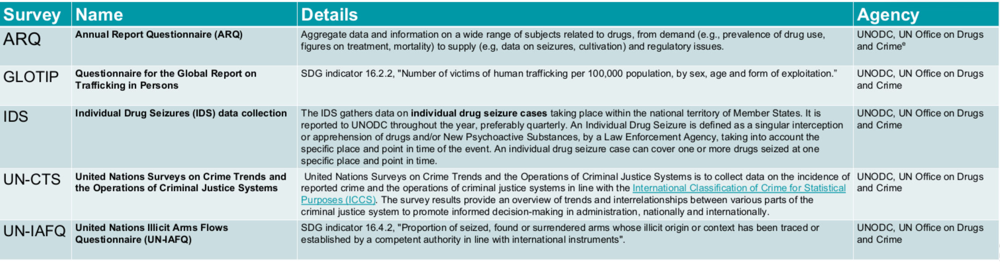

# CIFAL-Honolulu-Criminal-Justice

  

### Welcome

This project is a collaboration between CIFAL Honolulu and Chaminade University. The main goal of this project is to assess the staus of Small Island Developing States (SIDS) on Criminal Justice-Oriented Sustainable Development Goals (SDG's). Throughout our data-collection process, we encountered significant amounts of mising data. This framed our initial research question to be: Are SIDS reporting data on Criminal Justice-Oriented Sustainable Development Goals less than Non-SIDS. This can inspire insight into the culture and systems of SIDS playing an important role into the survey response rates.

### Data 

We accessed the [UNODC Status of Country Data Submissions by Data Collection Campaign Year](https://dataunodc.un.org/content/ms-data-collection-log) to create a dataset based on completion of 5 surveys shown below.

### Analysis

After creating the dataset, we created 3 data visualizations demonstrating survey completion by region for SIDS and Non-SIDS. These visualizations are in the *visualizations* folder and the code to create them is in the *analysis* folder.

### Project Participants

[Andrew Nishitomi](https://github.com/anishitomi)

[Connor Flynn](https://github.com/ConnorFlynn)

