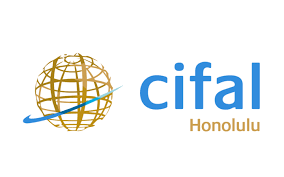
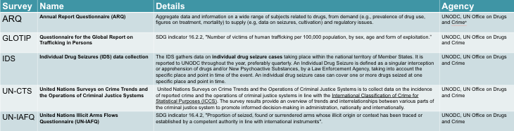

# CIFAL-Honolulu-Criminal-Justice

  

### Welcome

This project is a collaboration between CIFAL Honolulu and Chaminade University. The main goal of this project is to assess the staus of Small Island Developing States (SIDS) on Criminal Justice Oriented Sustainable Development Goals (SDG's). The first step of this process was to understand why so much of this data was missing. 

### Data 

We accessed the [UNODC Status of Country Data Submissions by Data Collection Campaign Year](https://dataunodc.un.org/content/ms-data-collection-log) to create a datset based on completion of 5 surveys shown below.

### Analysis

After creating the dataset, we created 3 data visualizations deomnstrating survey completion by region for SIDS and Non-SIDS. These visualizations are in the *visualizations* folder and the code to create them is in the *analysis* folder.

### Project Participants

[Andrew Nishitomi](https://github.com/anishitomi)

[Connor Flynn](https://github.com/ConnorFlynn)

